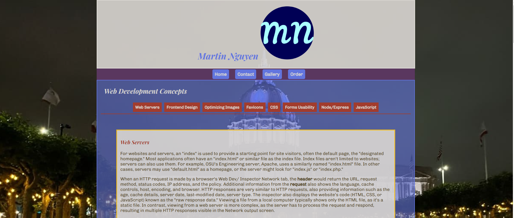
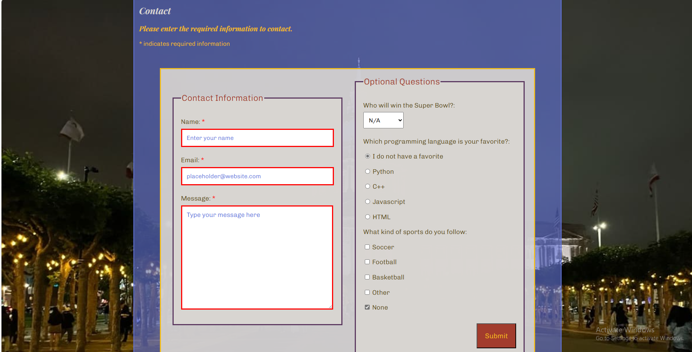
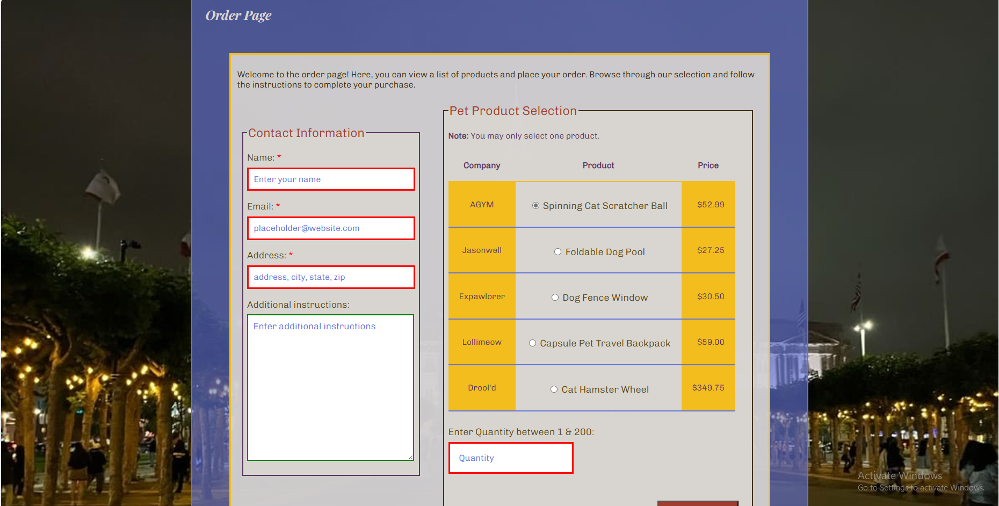

# Static Website Project

## Overview

This project showcases various web development concepts through a static website. It includes a responsive design, a contact form, an image gallery, and a product order form. The website demonstrates a range of web development skills and techniques, focusing on usability and aesthetic appeal.

## Features

- **Responsive Design**: Ensures the website is accessible and visually appealing on all devices.
- **Contact Form**: Allows users to send inquiries.
- **Image Gallery**: Displays a collection of images in a visually appealing layout.
- **Product Order Form**: Enables users to place orders for pet products.

## Technologies Used

- **HTML**: For structuring the web pages.
- **CSS**: For styling and layout.
- **JavaScript**: For client-side scripting and dynamic content.

## Project Structure

- `index.html`: The main landing page of the website.
- `contact.html`: The contact form page.
- `gallery.html`: The image gallery page.
- `order.html`: The product order form page.
- `main.css`: The stylesheet for the website.
- `main.js`: JavaScript file for interactive elements.

## Screenshots

